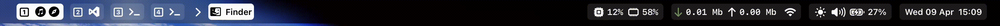

# SketchyBar Configuration

This repository contains a custom configuration for [SketchyBar](https://github.com/FelixKratz/SketchyBar), a flexible macOS status bar replacement.



## Features

(You may want to add more specific details about your configuration here)
- Displays spaces, active window, time, date, network status, CPU/RAM usage, volume, brightness, battery, and media playback based on the included scripts.

## Installation

1.  **Install SketchyBar:**
    Follow the official installation guide: [https://felixkratz.github.io/SketchyBar/config/installation](https://felixkratz.github.io/SketchyBar/config/installation)
    Typically, this involves using Homebrew:
    ```bash
    brew install sketchybar
    ```
    You might also need to install necessary fonts if specified by the configuration (check `sketchybarrc` or item scripts if unsure). Ensure `jq` is installed for JSON parsing used in some scripts:
    ```bash
    brew install jq
    ```

2.  **Use this Configuration:**
    Ensure these configuration files are located in `~/.config/sketchybar`. If you cloned a repository containing this configuration, make sure its contents are directly within `~/.config/sketchybar`, not in a subdirectory. The files should already be in place as this command is being run from within the configuration directory.

3.  **Make Scripts Executable:**
    Navigate to the configuration directory in your terminal and make the plugin, item, and script files executable:
    ```bash
    cd ~/.config/sketchybar
    chmod +x items/*.sh plugins/*.sh scripts/*.sh
    ```

4.  **Start/Restart SketchyBar:**
    If SketchyBar is already running, restart it to apply the new configuration:
    ```bash
    sketchybar --reload
    ```
    If it's not running, start it as a service (recommended for persistence):
    ```bash
    brew services start sketchybar
    ```
    Or run manually (useful for testing):
    ```bash
    sketchybar
    ```

## Customization

Feel free to modify the scripts in the `items/`, `plugins/`, and `scripts/` directories or the main `sketchybarrc` file to customize the appearance and behavior. Refer to the [SketchyBar Documentation](https://felixkratz.github.io/SketchyBar/) for more details.