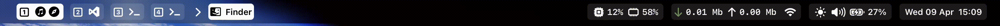

# SketchyBar Configuration

This repository contains a custom configuration for [SketchyBar](https://github.com/FelixKratz/SketchyBar), a flexible macOS status bar replacement.



## Features

- **Spaces & active window** — workspace indicators on the left powered by yabai events.
- **System stats** — CPU, RAM, network throughput, battery, volume, and brightness on the right.
- **Claude usage tracking** — dual-window utilisation widget centred in the bar (see below).

## Claude Usage Widget

Tracks your [Claude Pro/Max](https://claude.ai) API consumption directly in the status bar, centred between the workspace indicators and system stats.

### Layout

```
􀙚  2h ████░░░░ 38%   3d █░░░░░░░ 12%
     ↑white ↑color  ↑white  ↑white ↑color  ↑white
```

The `􀙚` brain icon is followed by the **5-hour window** (time remaining · progress bar · percentage) and then the **7-day window** in the same format.

### Pacing colour logic

The progress bars change colour based on whether usage is outpacing the reset cycle:

| Bar colour | Meaning |
|---|---|
| 🟢 Green | Utilisation % ≤ elapsed % of the reset cycle — on track |
| 🔴 Red | Utilisation % > elapsed % of the reset cycle — burning faster than expected |

Time-remaining and percentage labels are always white, independent of pacing state.

### Modular items

The widget is split into five independent Sketchybar items so that white text labels and coloured bars can coexist in the same bracket:

| Item | Content | Colour |
|---|---|---|
| `claude_icon` | `􀙚` brain icon | White (static) |
| `claude_5h` | 5h time remaining · progress bar | Icon: white · Bar: pacing colour |
| `claude_5h_pct` | 5h percentage | White |
| `claude_7d` | 7d time remaining · progress bar | Icon: white · Bar: pacing colour |
| `claude_7d_pct` | 7d percentage | White |

All five items are grouped in the `claude` bracket in `sketchybarrc`.

### Authentication

`plugins/claude_usage.sh` reads your OAuth token automatically from the macOS Keychain — no manual token management required under normal use.

- **Token source** — the keychain entry with service name `Claude Code-credentials`, written by the Claude CLI when you log in.
- **Expiry detection** — the script checks the `expiresAt` field in the keychain JSON before making any API call. Expired tokens are never sent to the API.
- **Token lifetime** — Claude OAuth access tokens are valid for approximately 8 hours.

#### Auth needed state

If the bar displays:

```
auth needed ↻
```

the stored token has expired. Run the Claude CLI once to refresh it:

```bash
claude
```

The bar will recover automatically on its next poll (every 5 minutes).

## Requirements

| Dependency | Purpose |
|---|---|
| [Sketchybar](https://github.com/FelixKratz/SketchyBar) | Status bar engine |
| [SF Symbols](https://developer.apple.com/sf-symbols/) | `􀙚` brain icon and other glyphs (bundled with macOS) |
| [yabai](https://github.com/koekeishiya/yabai) | Window manager — used for workspace space-change events |
| Python 3 | JSON parsing in `plugins/claude_usage.sh` (bundled with macOS) |
| `colors.sh` | Shared colour palette (`$RED`, `$GREEN`, `$WHITE`, etc.) sourced by all plugins |
| Claude CLI (`claude`) | Populates `Claude Code-credentials` in the Keychain; needed to refresh expired OAuth tokens |

## Installation

1.  **Install SketchyBar:**
    Follow the official installation guide: [https://felixkratz.github.io/SketchyBar/config/installation](https://felixkratz.github.io/SketchyBar/config/installation)
    Typically, this involves using Homebrew:
    ```bash
    brew install sketchybar
    ```

2.  **Use this Configuration:**
    Ensure these configuration files are located in `~/.config/sketchybar`. If you cloned a repository containing this configuration, make sure its contents are directly within `~/.config/sketchybar`, not in a subdirectory. The files should already be in place as this command is being run from within the configuration directory.

3.  **Make Scripts Executable:**
    Navigate to the configuration directory in your terminal and make the plugin, item, and script files executable:
    ```bash
    cd ~/.config/sketchybar
    chmod +x items/*.sh plugins/*.sh scripts/*.sh
    ```

4.  **Start/Restart SketchyBar:**
    If SketchyBar is already running, restart it to apply the new configuration:
    ```bash
    sketchybar --reload
    ```
    If it's not running, start it as a service (recommended for persistence):
    ```bash
    brew services start sketchybar
    ```
    Or run manually (useful for testing):
    ```bash
    sketchybar
    ```

## Updating the App Icon Map

App icons in the spaces and front-app item are rendered using the [sketchybar-app-font](https://github.com/kvndrsslr/sketchybar-app-font). The font and its app-name mappings are kept in sync via `scripts/update_icon_map.sh`, which pulls the latest release directly from GitHub.

```bash
CONFIG_DIR="$HOME/.config/sketchybar" bash ~/.config/sketchybar/scripts/update_icon_map.sh
sketchybar --reload
```

The script:
- Fetches the latest release from the GitHub API
- Downloads the pre-built `icon_map.sh` and updates `plugins/icon_map_fn.sh`
- Downloads and installs the updated font to `~/Library/Fonts/sketchybar-app-font.ttf`

## Customization

Feel free to modify the scripts in the `items/`, `plugins/`, and `scripts/` directories or the main `sketchybarrc` file to customize the appearance and behavior. Refer to the [SketchyBar Documentation](https://felixkratz.github.io/SketchyBar/) for more details.